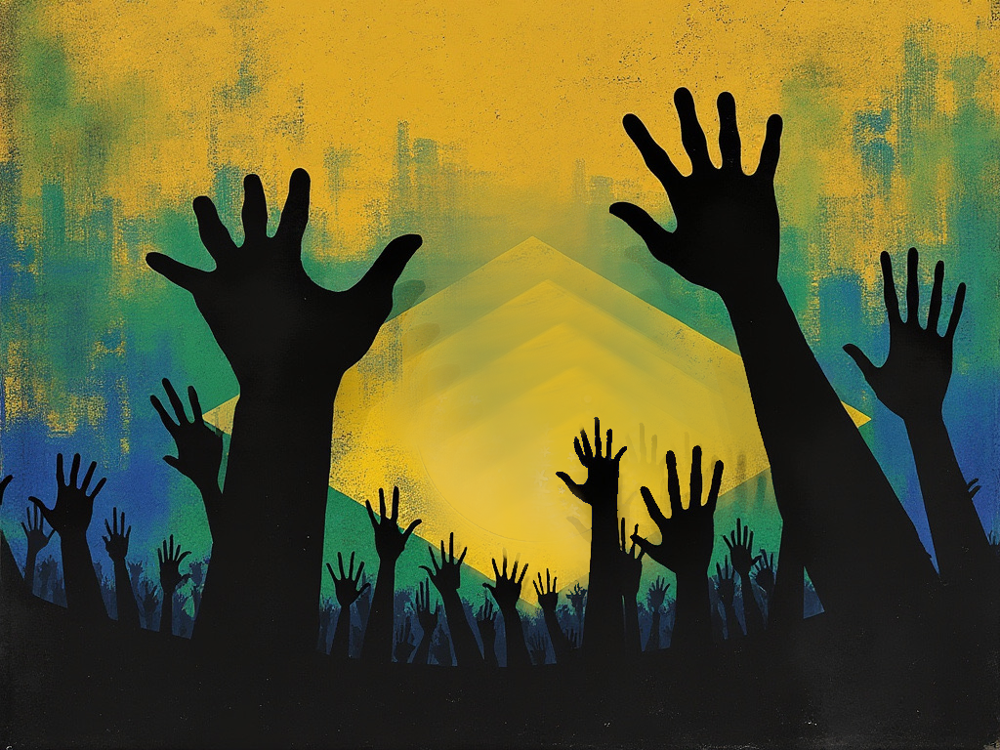
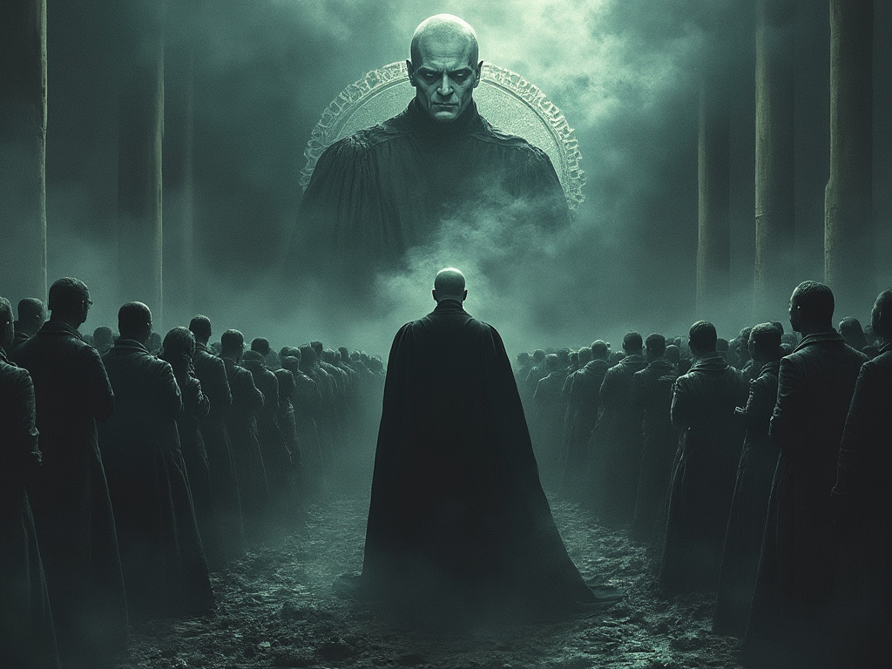

# divergent.manifest

## [Portuguese](README.md) * [English](README_en.md) * [Spanish](README_es.md)

## What is this manifesto about?
If you feel that your country's freedom is at risk, or even becoming a dictatorship, it might be worth knowing the fable of Avillan. The fable of Avillan can help us understand how individual freedoms are lost and how totalitarian regimes are established.

The __first goal__ of this work is to warn about the danger of collectivist and totalitarian ideologies - the reason why the manifesto was written.

The __second goal__ is to provide technological tools to ensure freedom of speech. If you live in a place where freedom of speech is under threat, these tools can help resist and preserve freedom. However, if you are already living in a totalitarian dictatorship, these tools become a matter of survival.

_“The price of freedom is eternal vigilance” - Thomas Jefferson_

## Evil prospers when good men do nothing
_Manifesto - The sad fable of Avillan_

The year is 2030, and Avillan is no longer a free country. Society is completely controlled by a totalitarian dictatorship that has profoundly transformed the lives of its citizens. For decades, a meticulous agenda gradually eroded individual freedoms through a collectivist ideology. The “us versus them” division polarized society, weakening democracy and destroying old national values. The Judiciary secretly forged an alliance with the Executive to put a corrupt populist, who was imprisoned, in power. Through this puppet, an old and dangerous aristocracy accumulated far more power than should have been possible.

The Judiciary proclaimed itself the “__political moderator__.” Using the narrative of protecting democracy from “fake news” and “hate speech,” it began censoring and legislating. Step by step, Avillan's freedom was fatally poisoned. The Legislature, which was under attack, was passive, lacking the courage to resist, and thus turned a blind eye. The population no longer felt represented, and when Supreme Court Judge Alexander Voldemort dissolved Congress, no one stood by the politicians, as they were nothing more than cowardly parasites. The people of Avillan no longer believe in the country’s electoral system. The Judiciary's interference in political debate, media manipulation, suspicions of fraud, and lack of transparency in the electronic voting system turned elections in Avillan into an expensive theater, merely allowing the international community to call Avillan's dictatorship an "Elective Democracy." In Avillan, questioning possible failures in the electoral system and calling for improvements has become a crime against "Democracy." Thus, the “Regime” was born.

In Avillan, __freedom of speech__ no longer exists. The media is fully controlled by the State, and independent journalists have been silenced or imprisoned. Television networks and “digital influencers” are well-paid to act as promoters of the Regime. In a synchronized way, they manipulate public opinion in favor of the “Regime” and “cancel” any dissenting thoughts. Money flows through a cultural incentive law that gives a legal façade to the entire scheme. Today, social media is monitored, and through secret subpoenas, the Judiciary can arbitrarily ban people from platforms without any justification. Any criticism, even about wrongdoing, is considered an attack on the Rule of Law and treated as treason.

__Private property__ no longer exists. The Regime, manipulating laws and fabricating accusations of illegal fires and other baseless environmental infractions, began a series of mass expropriations. Productive farms and agricultural lands were confiscated under the pretext of protecting the environment or redistributing land more “fairly” to landless farmers and indigenous peoples. Terrorist groups, disguised as landless farmers, spread fear and violence in the countryside. Food production plummeted, leading to shortages and rising prices. The old prosperity gave way to misery, and ignorance was sown as a means of prolonging the Regime's longevity.

__Education__ was reshaped to serve the interests of the dictators. Today, the school curriculum promotes the Regime’s ideology, discourages critical thinking, and suppresses historical facts that do not favor the official narrative. Childhood has been inundated with premature sexualization, and respect for elders has become a joke. Even Avillan’s native language was attacked with the concept of “neutral language,” which only divided and dumbed down students. Instead of promoting basic education and fostering opportunities for the neediest population, the Regime opted for a racist approach, differentiating people by their skin color and sexuality, promoting disproportionate spending on universities, and creating a quota system that enslaved minorities. It may seem strange, but in Avillan, if you are born a heterosexual white man, you are labeled a “Potential Rapist.” Teachers are monitored and encouraged to report students who show “fascist” behavior. Universities have become breeding grounds for mass indoctrination and the destruction of individuality. Disinterested parents now see their children being indoctrinated into blind obedience to the Regime.

__Security forces__ are true mercenaries of the Regime and have vast powers. Patrols are present on the streets, and curfews are regularly imposed. Any resistance or disobedience is violently repressed. To finance this parallel army, the Regime allied with drug traffickers and became a global drug distribution center. The money from this operation ensures that mercenaries are well-paid and loyal to the Regime. Even the right to assemble or have a religion has been eliminated. Banking and telephone secrecy have been abolished. There is no longer paper money in Avillan. The State implemented a state digital currency and actively uses it to financially coerce and control the population.

The __economy__ is deteriorating, yet most resources are directed to projects that benefit only the “friends” of the Regime. Small businesses face excessive bureaucracy and the highest taxes in the world, while large corporations aligned with the Regime enjoy privileges and tax exemptions. International investment no longer happens in Avillan due to the country’s absurd risk. The Regime is large and wasteful, and to sustain its enormous expenses, it had no choice but to promote runaway inflation, harming the poorest population the most. Young couples seeking a better future find no option but to emigrate from Avillan in search of freedom and opportunity for their children. With each passing year, Avillan becomes more indebted, older, and with less human capital.

Through its inaction, Avillan will spend decades under the iron fist of the Regime.