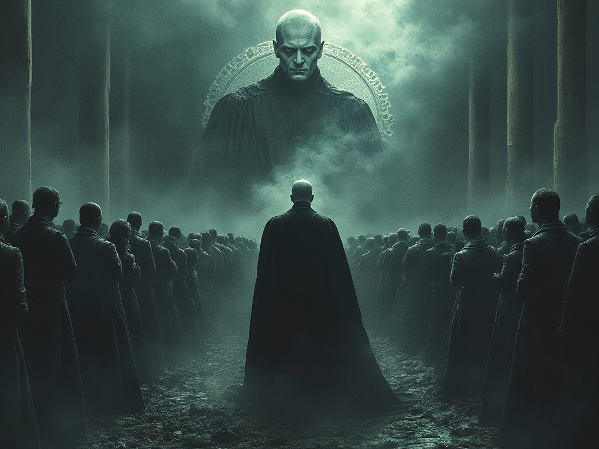

# divergent.manifest

## [Português](README.md) * [English](README_en.md) * [Español](README_es.md)

## ¿De qué trata este manifiesto?
Si sientes que la libertad de tu país está en riesgo, o incluso se está convirtiendo en una dictadura, tal vez valga la pena conocer la fábula de Avillan. La fábula de Avillan puede ayudarnos a entender cómo se pierden las libertades individuales y cómo se instauran los regímenes totalitarios.

El __primer objetivo__ de este trabajo es advertir sobre el peligro de las ideologías colectivistas y totalitarias, que es la razón por la cual se escribió el manifiesto.

El __segundo objetivo__ es proporcionar herramientas tecnológicas para garantizar la libertad de expresión. Si vives en un lugar donde la libertad de expresión está amenazada, estas herramientas pueden ayudar a resistir y preservar la libertad. Pero, si ya vives en una dictadura totalitaria, estas herramientas son una cuestión de supervivencia.

_“El precio de la libertad es la vigilancia eterna” - Thomas Jefferson_

## El mal prospera cuando los hombres buenos no hacen nada
_Manifiesto - La triste fábula de Avillan_

El año es 2030, y Avillan ya no es un país libre. La sociedad está completamente controlada por una dictadura totalitaria, que ha transformado profundamente la vida de sus ciudadanos. Durante décadas, una agenda meticulosa fue minando gradualmente las libertades individuales a través de una ideología colectivista. El divisionismo del "nosotros contra ellos" polarizó a la sociedad, debilitando la democracia y destruyendo antiguos valores nacionales. El Poder Judicial, en secreto, forjó una alianza con el Ejecutivo para poner en el poder a un populista corrupto que estaba preso. A través de este títere, una antigua y peligrosa aristocracia acumuló mucho más poder del que debería haber sido posible.

El Poder Judicial se autoproclamó “__moderador político__”. Usando la narrativa de que estaba protegiendo la democracia de las “fake news” y los “discursos de odio”, comenzó a censurar y legislar. Paso a paso, la libertad de Avillan fue envenenada fatalmente. El Legislativo, que estaba bajo ataque, fue omiso, le faltó coraje para resistir y, así, cerró los ojos. La población dejó de sentirse representada y, cuando el juez de la Corte Suprema, Alexander Voldemort, disolvió el Congreso, nadie se puso del lado de los políticos; al fin y al cabo, no eran más que parásitos cobardes. El pueblo de Avillan ya no cree en el sistema electoral del país. La interferencia del Poder Judicial en el debate político, la manipulación de los medios, las sospechas de fraude y la falta de transparencia del sistema de urnas electrónicas convirtieron las elecciones en Avillan en un teatro costoso que solo sirve para que la comunidad internacional pueda llamar a la dictadura de Avillan “Democracia Electiva”. En Avillan, cuestionar posibles fallos en el sistema electoral y pedir mejoras se ha convertido en un delito contra la "Democracia". Así nació el “Régimen”.

En Avillan, la __libertad de expresión__ ya no existe. Los medios están completamente controlados por el Estado, los periodistas independientes han sido silenciados o encarcelados. Las redes de televisión y los “influencers” son bien pagados para actuar como promotores del Régimen. De forma sincronizada, manipulan la opinión pública a favor del “Régimen” y “cancelan” cualquier pensamiento divergente. El dinero fluye a través de una ley de incentivos culturales que da una apariencia de legalidad a todo el esquema. Hoy, las redes sociales están monitoreadas y, de manera arbitraria, mediante citaciones secretas, el Poder Judicial puede prohibir a las personas en las plataformas sin ninguna justificación. Toda crítica, incluso sobre malas acciones, se considera un ataque al Estado de Derecho y se trata como un delito de traición.

La __propiedad privada__ ya no existe. El Régimen, manipulando leyes y fabricando acusaciones de incendios ilegales y otras infracciones ambientales infundadas, inició una serie de expropiaciones masivas. Las granjas productivas y las tierras agrícolas fueron confiscadas bajo el pretexto de proteger el medio ambiente o redistribuir la tierra de manera más "justa" para los agricultores sin tierra y los pueblos originarios. Grupos terroristas, disfrazados de agricultores sin tierra, difundieron el miedo y la violencia en el campo. La producción de alimentos cayó drásticamente, lo que provocó escasez y aumentos de precios. La antigua prosperidad dio lugar a la miseria, y la ignorancia fue sembrada como medio para prolongar la longevidad del Régimen.

La __educación__ fue reformada para servir a los intereses de los dictadores. Hoy, el currículo escolar promueve la ideología del Régimen, desalentando el pensamiento crítico y suprimiendo los hechos históricos que no favorecen la narrativa oficial. La infancia ha sido inundada por una sexualización prematura, y el respeto a los mayores se ha convertido en una broma. Incluso la lengua nativa de Avillan fue atacada con el concepto de “lenguaje neutro”, que solo dividía y embrutecía a los estudiantes. En lugar de promover la educación básica y fomentar oportunidades para la población más necesitada, el Régimen optó por un enfoque racista, diferenciando a las personas por su color de piel y sexualidad, promoviendo un gasto desproporcionado en las universidades y creando un sistema de cuotas que esclavizaba a las minorías. Puede parecer extraño, pero en Avillan, si naces como un hombre blanco heterosexual, serás tachado de "Violador en Potencia". Los maestros son vigilados y alentados a denunciar a los estudiantes que muestren un comportamiento “fascista”. Las universidades se han convertido en corrales de una adoctrinación masiva y destrucción de la individualidad. Los padres desinteresados ahora ven a sus hijos ser adoctrinados en una obediencia ciega al Régimen.

Las __fuerzas de seguridad__ son verdaderos mercenarios del Régimen y tienen amplios poderes. Las patrullas están presentes en las calles y los toques de queda se imponen regularmente. Cualquier resistencia o desobediencia es reprimida con violencia. Para financiar este ejército paralelo, el Régimen se alió con narcotraficantes y se convirtió en un centro de distribución de drogas mundial. El dinero de esta operación asegura mercenarios bien remunerados, bien pagados y leales al Régimen. Incluso el derecho a congregarse o tener una religión ha sido eliminado. El secreto bancario y telefónico ha sido abolido. Ya no existe papel moneda en Avillan. El Estado implementó una moneda digital estatal y la utiliza activamente para coaccionar y controlar financieramente a la población.

La __economía__ está deteriorándose, pero aun así, la mayoría de los recursos se destinan a proyectos que solo benefician a los “amigos” del Régimen. Los pequeños negocios enfrentan una burocracia excesiva y los impuestos más altos del mundo, mientras que las grandes corporaciones alineadas con el Régimen disfrutan de privilegios y exenciones fiscales. La inversión internacional ya no ocurre en Avillan, ya que el riesgo del país es absurdo. El Régimen es grande y derrochador, y para mantener sus gastos faraónicos, tuvo como única opción promover una inflación desenfrenada, perjudicando principalmente a la población más pobre. Las parejas jóvenes, que buscan un futuro mejor, no encuentran otra opción que emigrar de Avillan en busca de libertad y oportunidades para sus hijos. Cada año, Avillan se endeuda más, envejece más y tiene menos capital humano.

Por su omisión, Avillan pasará décadas bajo el puño de hierro del Régimen.