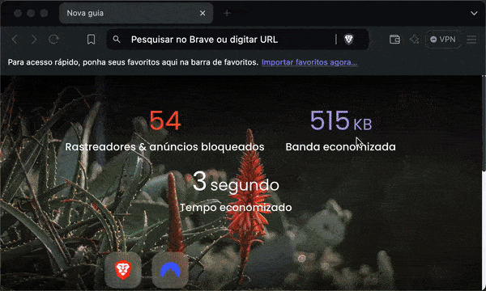

# Ferramentas
Nesta página, você encontrará uma seleção de ferramentas e tutoriais essenciais para garantir a liberdade de expressão e a privacidade na internet. De navegadores seguros e redes anônimas a plataformas descentralizadas, aqui você aprenderá como acessar a web de forma segura e contornar censura e vigilância online. Além disso, oferecemos guias sobre criptografia, serviços de mensagens seguras como Signal e Element, e estratégias para proteger suas comunicações e dados pessoais, assegurando sua voz em ambientes restritivos. Também abordamos o uso de criptomoedas para pagamentos e doações anônimas, permitindo que você apoie causas e receba contribuições de forma descentralizada e sem intermediários, protegendo sua privacidade financeira em contextos de censura ou controle econômico.

## Navegadores Seguros

### Brave ([brave.com](https://brave.com/pt-br))
O Brave é um navegador de internet desenvolvido com foco na privacidade, segurança e alto desempenho. Ele proporciona uma navegação rápida ao proteger os usuários contra rastreamentos e publicidade invasiva, bloqueando automaticamente anúncios e scripts de terceiros. Além disso, o Brave prioriza a privacidade com recursos como a integração com a rede Tor e suporte à Web3, permitindo acesso a conteúdos descentralizados. Em essência, o Brave é um navegador que combina velocidade e segurança, oferecendo uma navegação otimizada e protegida, sem comprometer a liberdade e a privacidade do usuário.

  
Saiba mais...

#### Navegação Anônima com Tor
<table border=none>
  <tr>
    <td>
      
    </td>
    <td>
      O Tor é uma ferramenta que ajuda a proteger sua privacidade online. Quando você navega na internet, seu endereço IP (um número que identifica seu computador na rede) pode ser visto por sites ou outras pessoas, o que revela sua localização e atividades. O Tor funciona como uma espécie de “labirinto digital”, onde seus dados passam por vários computadores ao redor do mundo, tornando muito difícil para alguém saber de onde você realmente está acessando. No navegador Brave, você pode ativar o Tor nas configurações para usar essa proteção extra. Isso é especialmente útil para quem quer navegar de forma mais anônima e segura, evitando rastreamentos. 
      <a href="https://support.brave.com/hc/en-us/articles/360018121491-What-is-a-Private-Window-with-Tor-Connectivity" target="_blank">mais informações</a>    
    </td>
  </tr>
</table>

## Redes Anônimas

### Surfshark VPN ([surfshark.com](https://surfshark.com/pt-br))
VPN é a sigla para Rede Privada Virtual (Virtual Private Network, no inglês), é uma ferramenta que criptografa seu tráfego na internet e oculta seu endereço de IP (Protocolo de Internet) para garantir uma conexão segura e privada na internet com a proteção da identidade online do usuário. Isso impede que terceiros espionem ou coletem dados sobre suas atividades na Internet, já que todas as informações ficam ocultas por trás de um código

  
Saiba mais...

#### Por que você precisa de VPN? 
<table border=none>
  <tr>
    <td></td>
    <td></td>
    <td></td>
  </tr>
  <tr>
    <td><b>Mais Segurança na Rede<b/> 
    Ao criptografar o tráfego, a VPN protege contra uma variedade de ataques cibernéticos. É especialmente útil se você usa Wi-Fi público, pois redes públicas representam mais ameaças do que sua rede residencial.</td>
    <td><b>Contorne a censura<b/> 
    Alguns governos censuram fortemente o uso da internet. A VPN pode ajudar você a superar essas restrições, cuidar da sua identidade online e aproveitar o melhor que a internet tem a oferecer.</td>
    <td><b>Fuja da discriminação de preços por localização<b/> 
    Alguns sites utilizam sua localização e cookies para ajustar os preços de seus produtos e serviços. Com uma VPN, você pode evitar essas práticas de marketing e economizar dinheiro ao fazer compras online.</td>
  </tr>  
</table>

